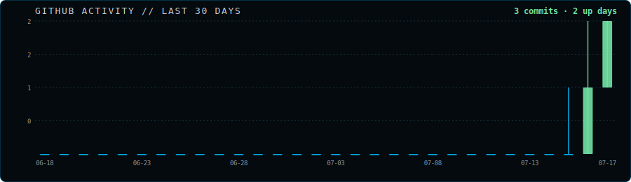

<div align="center">


<br/>

<a href="https://github.com/cheakhokkeat" target="_blank">
  
</a>

<a href="https://maps.app.goo.gl/ogGM6A5FwJN3xuNn7" target="_blank">

</a>


</div>

<br/>

## 👋 About Me


```yaml
N4M3: Cheakhok Keat
10C4710N: Cambodia
UN1V3R517Y: Norton University
M4J0R: Software Development
4C4D3M1C_L3V3L: Second-year student
R0L3: Software Development Student
C4R33R_74RG37: Full-Stack Developer
5747U5: Learning | Building | Improving
```

I'm a **Software Development student**, currently building practical skills across frontend, backend, and databases. I learn best by building small real projects and researching problems as they come up.

---

## `> PROGRAMMING_LANGUAGES`

<div align="center">


</div>

---

## `> FRONTEND_DEVELOPMENT`

<div align="center">


</div>

---

## `> BACKEND_DEVELOPMENT`

<div align="center">


</div>

---

## `> FRAMEWORKS_AND_LIBRARIES`

<div align="center">


</div>

---

## `> DATABASE_SYSTEMS`

<div align="center">


</div>

---

## `> DEVELOPMENT_TOOLS`

<div align="center">


</div>

---

## `> DESIGN_TOOLS`

<div align="center">


</div>

---

## `> OPERATING_SYSTEMS_AND_COMMAND_LINE`

<div align="center">


</div>

---

## `> LEARNING_PROGRESS`

<div align="center">


</div>

<a href="https://github.com/cheakhokkeat">


</a>

---

### 🚧 Projects in Development or Learning

<table>
<tr>
<td width="50%" valign="top">

### 🛒 E-Commerce Store

A web store project for practicing product listings, shopping cart logic, order processing, and full-stack integration between frontend, backend, and database.


</td>
<td width="50%" valign="top">

### 🧾 POS (Point of Sale) System

A retail-style application for practicing product and inventory management, transaction processing, receipt generation, and basic sales reporting.


<!-- <a href="https://www.github.com">
 -->

</td>
</tr>
<tr>
<td width="50%" valign="top">

### 🤖 Chatbot

A conversational assistant project for practicing prompt engineering, API integration, and basic natural-language interaction flows.


<!-- <a href="https://www.github.com">
 -->

</td>
<td width="50%" valign="top">

### 📊 Data Analysis Dashboard

An exploratory data project for practicing data cleaning, visualization, and summarizing insights from a real dataset using Python's data-analysis tools.


<!-- <a href="https://www.github.com">
 -->

</td>
</tr>
<tr>
<td width="50%" valign="top">

### 🎓 Student Management System

A management application for practicing CRUD operations, student records, validation, search, and relational database concepts.


<!-- <a href="https://www.github.com">
 -->

</td>
<td width="50%" valign="top">

### 🏦 Banking System

An educational application for practicing object-oriented programming, user workflows, account operations, validation, and database integration.


<!-- <a href="https://www.github.com">
 -->

</td>
</tr>
</table>

---

## 🗺️ Future Learning Roadmap

🟢 **Phase 1 — Full-Stack Foundation**
JavaScript fundamentals · DOM & async JS · REST communication · Git workflow

🔷 **Phase 2 — Backend Specialization**
Java & Spring Boot · REST APIs · Auth & JWT · Testing & documentation

🔹 **Phase 3 — Deployment & DevOps**
Docker · GitHub Actions / CI-CD · AWS deployment

🔵 **Phase 4 — AI Integration**
FastAPI · Chatbots & RAG · AI agents & automation

🌌 **Later Goals**
Redis · System design · Microservices · Deep learning · Cloud (Azure/GCP)

---

## `> CAREER_OBJECTIVE`

<div align="center">


</div>

<table>
<tr>
<td valign="top" width="33%">

**🎯 First Target**

Land a Web Developer internship or entry-level position to start applying my skills in a real environment.

</td>
<td valign="top" width="33%">

**📅 Second Target**

Build job-ready development skills, complete practical projects, and prepare for internship or junior developer opportunities.

</td>
<td valign="top" width="33%">

**🚀 Long-Term Goal**

Grow into a Full-Stack Developer, progress toward technical leadership or management, and eventually build a technology business.

</td>
</tr>
</table>

### 🔍 Interests

<div align="center">


</div>

---

## `> GITHUB_ANALYTICS`

<div align="center">


  <br />


<br />



</div>

---

## `> GITHUB_TROPHIES`

<div align="center">


</div>

---

## `> CONTRIBUTION_SNAKE`

<div align="center">

  <picture>
    <source
      media="(prefers-color-scheme: dark)"
      srcset="https://raw.githubusercontent.com/cheakhokkeat/cheakhokkeat/output/github-contribution-grid-snake-dark.svg"
    />
    <source
      media="(prefers-color-scheme: light)"
      srcset="https://raw.githubusercontent.com/cheakhokkeat/cheakhokkeat/output/github-contribution-grid-snake.svg"
    />
    
  </picture>

</div>

---

## `> DEVELOPER_QUOTE`

<div align="center">

```text
"Every small project is another step toward becoming a better developer."
```


</div>

---

## `> CONNECT_WITH_ME`

<div align="center">

<a href="https://github.com/cheakhokkeat">
  
</a>
<a href="https://www.facebook.com/100045519039016">
  
</a>
<a href="https://www.instagram.com/cheakhokkeat">
  
</a>
<a href="https://t.me/cheakhokkeat">
  
</a>
<a href="https://t.me/cheakhokkeatofficial">
  
</a>
<a href="https://www.youtube.com/channel/UCTWO0kbbori1ESkdxPZSn4A?sub_confirmation=1">
  
</a>
<a href="https://www.tiktok.com/@7613071806707139614">
  
</a>
<a href="https://x.com/2029371765043220480">
  
</a>

</div>

<br />

<div align="center">

### `SYSTEM STATUS: ONLINE`

<b>DON'T FORGOT CHEAKHOK</b><br>
<sub>©️cheakhokkeat</sub>

</div>


