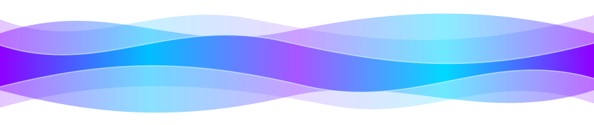
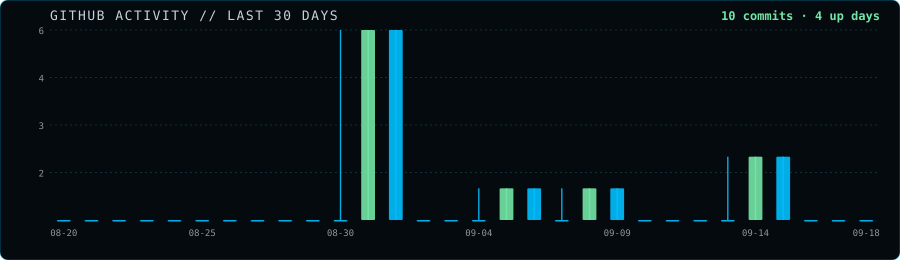

<!-- GitHub strips inline CSS. Keep layout in supported HTML attributes and decoration in image assets. -->

  <!-- GitHub avatar syncs daily via Update Profile Panel in Actions; run it manually for an earlier refresh.
       Local rebuild: python scripts/generate_profile_panel.py (uses assets/profile-avatar.jpg). -->
  

  

    
  

  

    
    
    
  

   

  

    
    
  

  <h1>
    
    About Me
    
  </h1>

I'm a **Software Development student**, currently building practical skills across frontend, backend, and databases. I learn best by building small real projects and researching problems as they come up.

  

<h3>&gt; Programming Languages</h3>

  
  
  
  
  

<h3>&gt; Frontend Development</h3>

  

<h3>&gt; Backend Development</h3>

  
  
  
  

<h3>&gt; Frameworks and Libraries</h3>

  

<h3>&gt; Database Systems</h3>

  
  

<h3>&gt; Development Tools</h3>

  

<h3>&gt; Design Tools</h3>

  

<h3>&gt; Operating System and Command Line</h3>

  

 

  

  

  <h1>
    
    GitHub Analytics
    
  </h1>

  
    

  

    
    
  

  

    
    
  

  
    
  
   
  

 

  <h1>
    
    GitHub Trophies
    
  </h1>
  

 

  <h1>
    
    Holopin Badges
    
  </h1>

  

 

  <h1>
    
    Pacman
    
  </h1>
  

 

  <h3>
    Every small project is another step toward becoming a better developer.
  </h3>
  

  <h1>
    
    Connect With Me
    
  </h1>

  
  
  
  
  
  
  
  

 

  
  <b>Don't Forget Cheakhok Keat</b>
  
   
  ©️cheakhokkeat

